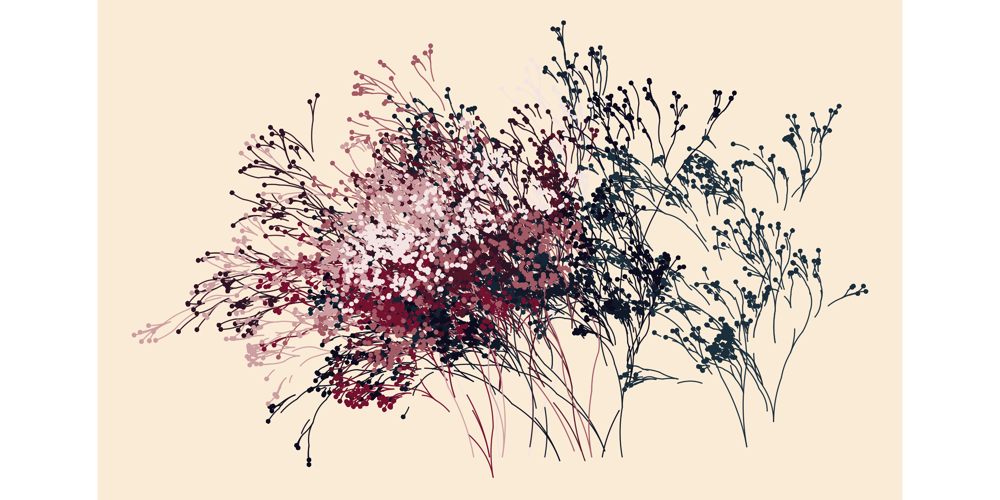

<!-- README.md is generated from README.Rmd. Please edit that file -->

# Flametree

<!-- badges: start -->

[](https://github.com/djnavarro/flametree/actions)
[](https://codecov.io/gh/djnavarro/flametree?branch=master)
[](https://lifecycle.r-lib.org/articles/stages.html#experimental)
[](https://CRAN.R-project.org/package=flametree)
<!-- badges: end -->

Flametree provides a system for making generative art in R, written with
two goals in mind. First, and perhaps foremost, art is inherently
enjoyable and generative artists working in R need packages no less than
any other R users. Second, the system is designed to be useful in the
classroom: getting students to make artwork in class is an enjoyable
exercise and flametree can be used as a method to introduce some key R
concepts in a fun way. The package is not (yet) on CRAN but you can
install the development version of flametree with:

``` r
# install.packages("devtools")
devtools::install_github("djnavarro/flametree")
```

Flametree is fairly flexible and produces art in several different
styles. One example is shown here, other possibilities are described
throughout the documentation.

``` r
library(flametree)
flametree_grow(seed = 2, trees = 3) %>% 
  flametree_plot(style = "voronoi")
```

<!-- -->
