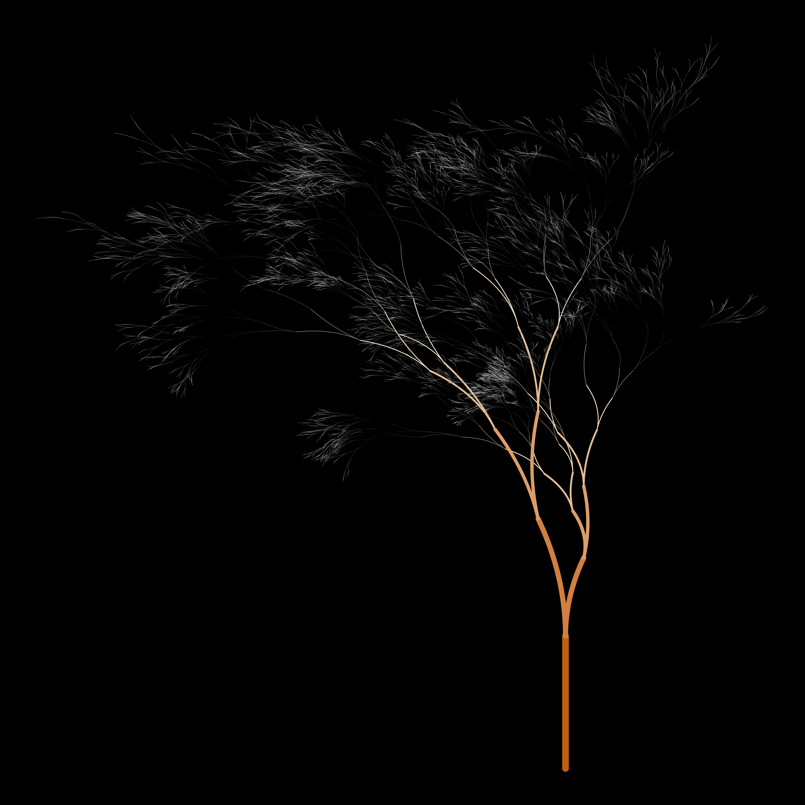
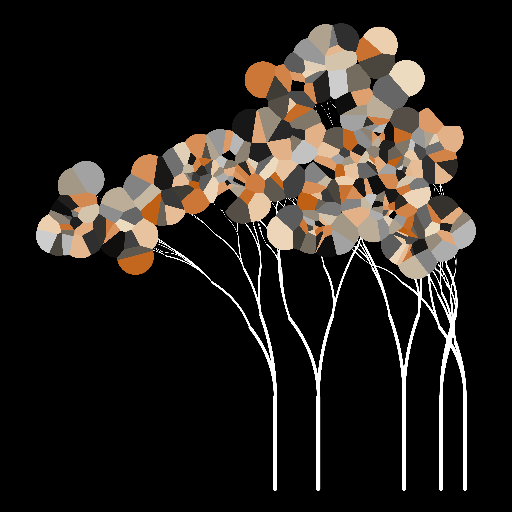
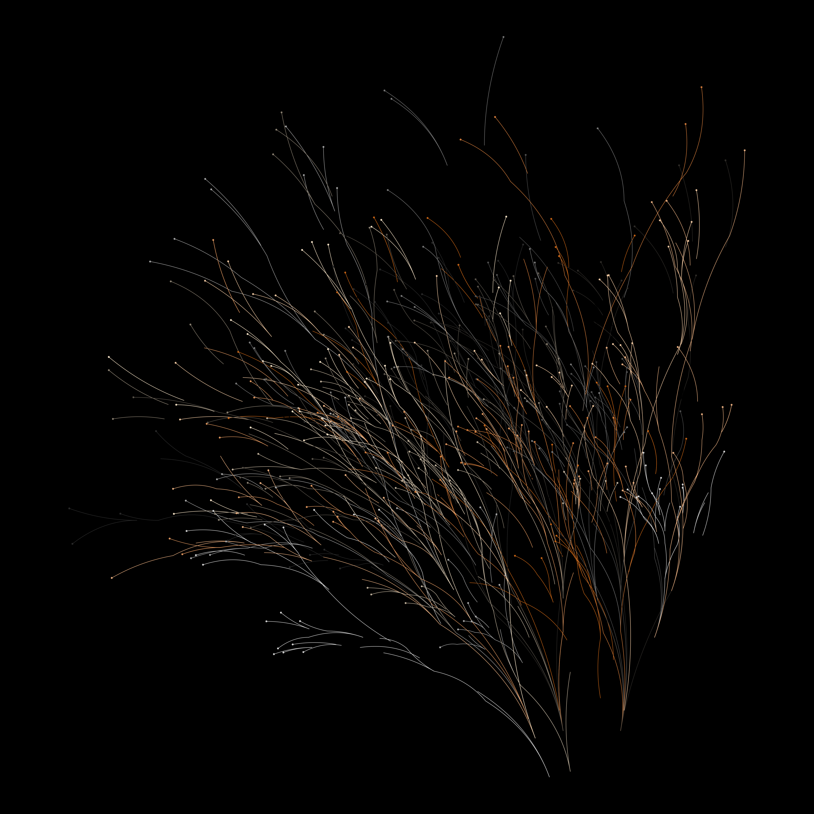

<!-- README.md is generated from README.Rmd. Please edit that file -->

# flametree

<!-- badges: start -->

[](https://github.com/djnavarro/flametree/actions)
[](https://codecov.io/gh/djnavarro/flametree?branch=master)
[](https://lifecycle.r-lib.org/articles/stages.html#experimental)
[](https://CRAN.R-project.org/package=flametree)
<!-- badges: end -->

The goal of flametree is to make pretty pictures.

## Installation

You can install the development version of flametree from
[GitHub](https://github.com/) with:

``` r
# install.packages("devtools")
devtools::install_github("djnavarro/flametree")
```

## Example

``` r
library(flametree)

flametree_grow(seed = 4, time = 12)  %>% 
  flametree_plot()         
```



``` r
flametree_grow(seed = 1, trees = 5)  %>% 
  flametree_plot(style = "voronoi")
```



``` r
flametree_grow(trees = 16)  %>% 
  flametree_plot(style = "nativeflora")
```


