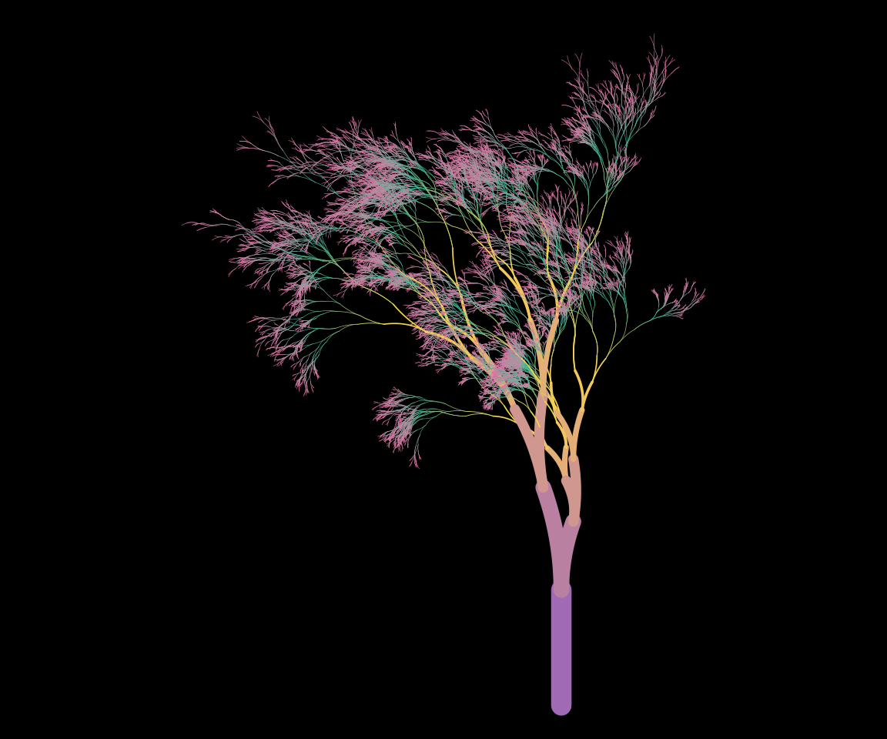
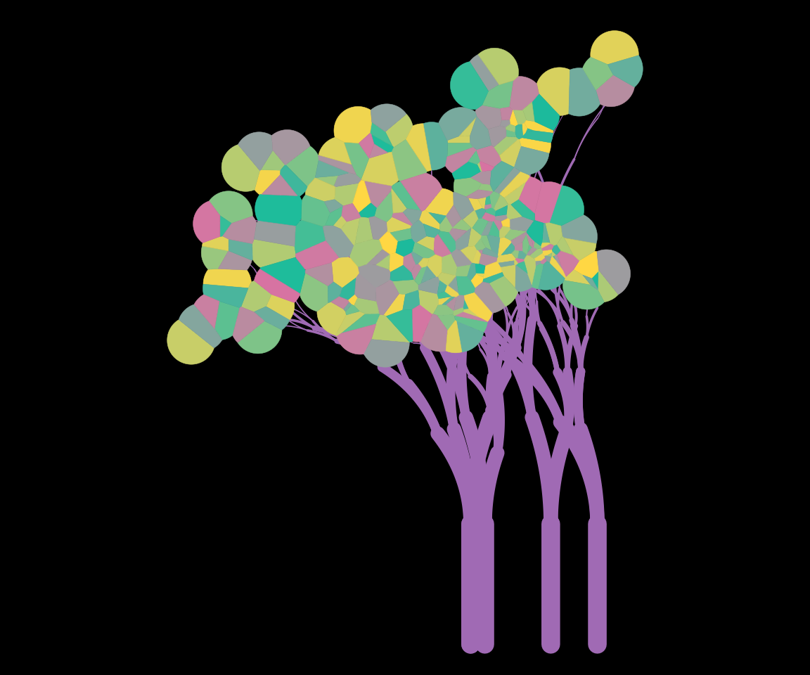
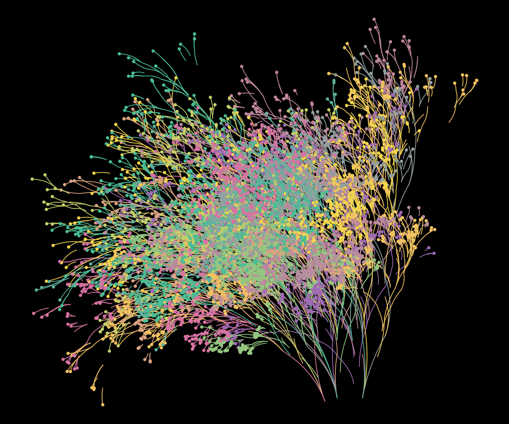
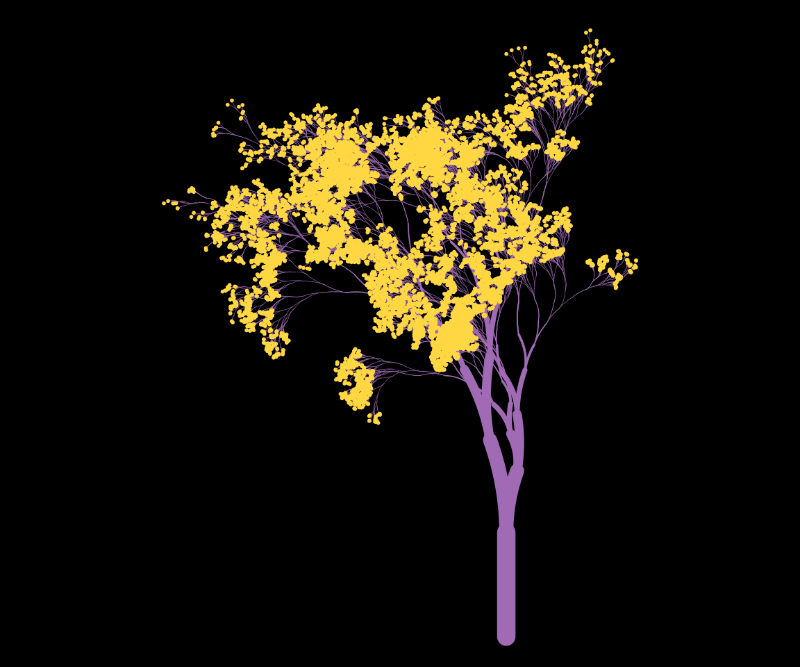
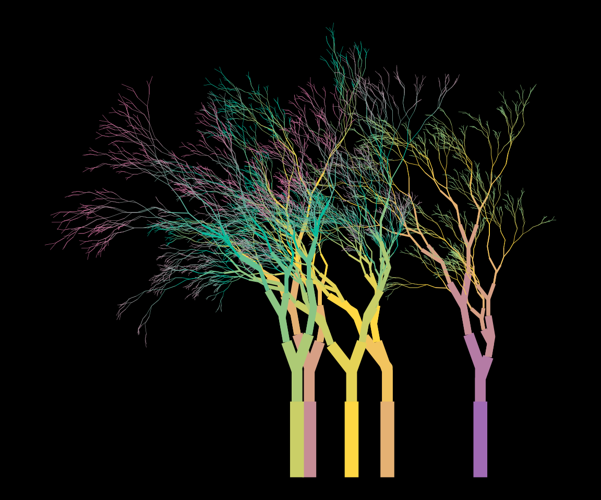
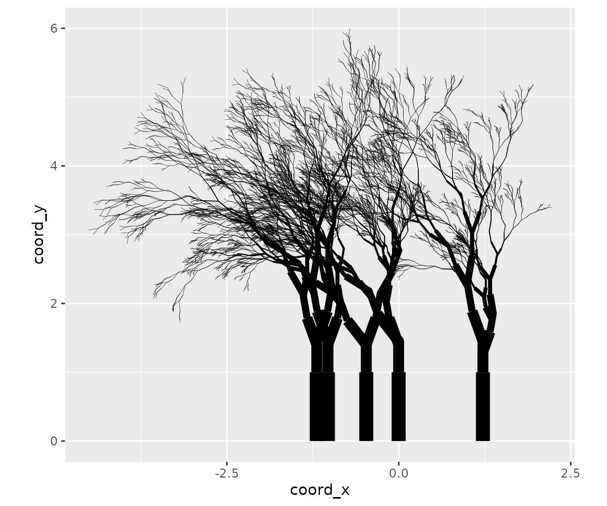

# Exploring plot styles

``` r
library(flametree)
```

The [getting
started](https://flametree.djnavarro.net/articles/articles/getting-started.md)
article showed how to modify the appearance of the output by specifying
the `background` and `palette` arguments. Changing these arguments will
change the colours to the plot, but only the colours. It does not affect
the way the plot function interprets the underlying data structure.
However, given that the plots are created using ggplot2, there is a lot
more flexibility in the the kind of images that can be created. The
[`flametree_plot()`](https://flametree.djnavarro.net/reference/flametree_plot.md)
function contains a `style` argument that alters the ggplot2 code used
to create the image, and can have a much larger effect on the resulting
image. I’ll walk through the different styles in this article, using the
following palette:

``` r
shades <- c("#A06AB4", "#FFD743", "#07BB9C", "#D773A2")
```

## Plain

Setting `style = "plain"` (the default) creates an output that resembles
the original “flametree” images: colours vary along the body of the
trees, and no “leaves” are drawn.

``` r
flametree_grow(time = 14) %>% 
  flametree_plot(
    palette = shades, 
    style = "plain"
  )
#> Warning: Using `size` aesthetic for lines was deprecated in ggplot2 3.4.0.
#> ℹ Please use `linewidth` instead.
#> ℹ The deprecated feature was likely used in the flametree package.
#>   Please report the issue at <https://github.com/djnavarro/flametree/issues>.
#> This warning is displayed once per session.
#> Call `lifecycle::last_lifecycle_warnings()` to see where this warning was
#> generated.
```



## Voronoi

Setting `style = "voronoi"` creates a plot where the tree bodies are
uniform in colour, and coloured “leaves” are drawn at the top of the
trees using a Voronoi tesselation of the locations of the terminal
nodes. Note that computing the tesselation is computationally expensive,
and this will likely produce errors if there are too many nodes.

``` r
flametree_grow(time = 6, trees = 5) %>% 
  flametree_plot(
    palette = shades, 
    style = "voronoi"
  )
```



## Native Flora

The `style = "nativeflora"` style creates a plot in which tree bodies
are rendered as thin segments, with a proportion of those segments
removed, and small points are drawn at the end of each terminal segment.

``` r
flametree_grow(
  time = 10, 
  trees = 12, 
  shift_x = spark_nothing()
) %>% 
  flametree_plot(
    palette = shades, 
    style = "nativeflora"
  )
```



## Wisp

Setting `style = "wisp"` is similar to the “nativeflora” style, but no
segments are removed, and the tree body is wider at the base.

``` r
flametree_grow(time = 14) %>% 
  flametree_plot(
    palette = shades,
    style = "wisp"
  )
```



## Minimal

Setting `style = "minimal"` produces a variant that does not use curved
segments.

``` r
flametree_grow(time = 10, trees = 5) %>% 
  flametree_plot(
    palette = shades, 
    style = "minimal"
  )
```



## Theme Gray

Finally, if the user sets `style = "themegray"` the result will be a
plot that uses the traditional gray theme used in ggplot2.

``` r
flametree_grow(time = 10, trees = 5) %>% 
  flametree_plot(
    palette = shades, 
    style = "themegray"
  )
```


