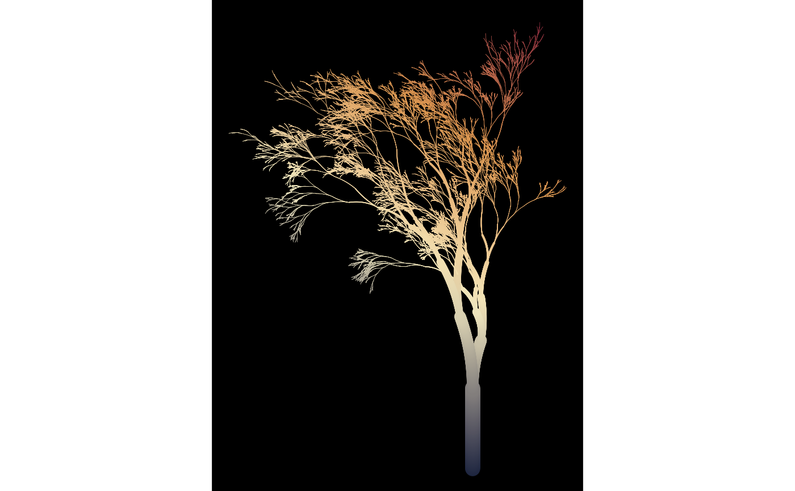
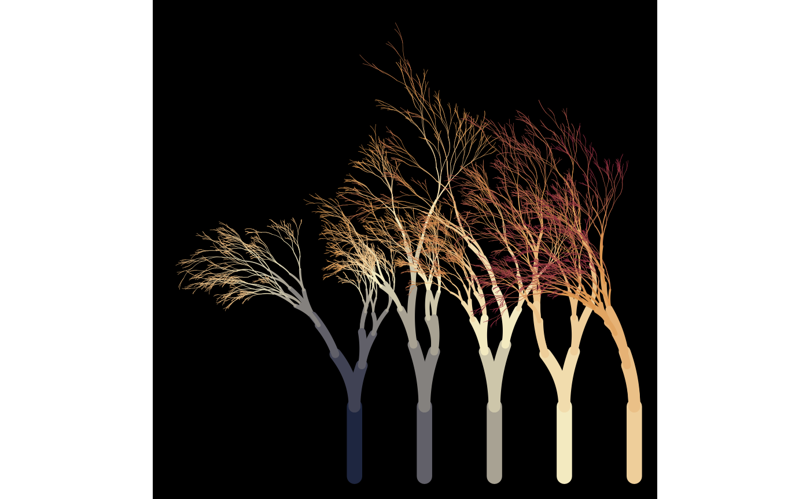
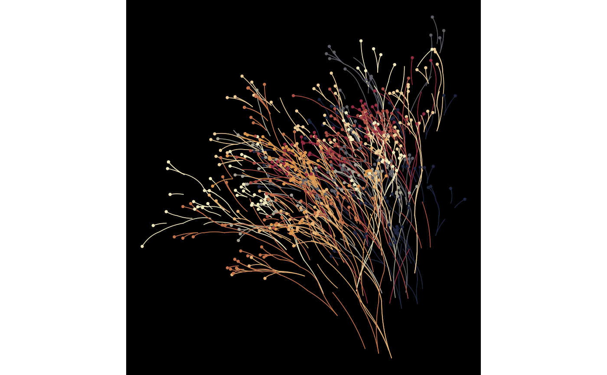

# Using spark functions

``` r

library(flametree)
```

Some arguments to
[`flametree_grow()`](https://flametree.djnavarro.net/reference/flametree_grow.md)
take numeric input, but `seg_col`, `seg_wid`, `shift_x`, `shift_y`, and
`prune` all take functions as their input, and are used to control how
the colours (`seg_col`) and width (`seg_wid`) of the segments are
created, the horizontal (`shift_x`) and vertical (`shift_y`)
displacement of the trees, and the probability that a given shoot is
pruned (`prune`). Functions passed to these arguments take four inputs:
`coord_x`, `coord_y`, `id_tree`, and `id_time` as input. Any function
that takes these variables as input and produces a numeric vector of the
same length as the input can be used for this purpose. However, as a
convenience, four “spark” functions are provided that can be used to
create functions that are suitable for this purpose:
[`spark_linear()`](https://flametree.djnavarro.net/reference/sparks.md),
[`spark_decay()`](https://flametree.djnavarro.net/reference/sparks.md),
[`spark_random()`](https://flametree.djnavarro.net/reference/sparks.md),
and
[`spark_nothing()`](https://flametree.djnavarro.net/reference/sparks.md).
Arguments passed to one of the spark functions determine the specific
function is generated. For example, this returns a function that is
linear in `coord_x` and `coord_y`:

``` r

spark_linear(x = 2, y = 3)
#> function (coord_x, coord_y, id_tree, id_time) 
#> {
#>     (x * coord_x) + (y * coord_y) + (tree * id_tree) + (time * 
#>         id_time) + constant
#> }
#> <bytecode: 0x5643d7042400>
#> <environment: 0x5643d7042e80>
```

We could use this function to control how the colours in the tree
change:

``` r

flametree_grow(
  time = 12,
  seg_col = spark_linear(x = 2, y = 3)
) |> 
  flametree_plot()
```



Different parameter settings will produce different linear gradients.
For example, we could have the colours change linearly across tree
number and time, and have the horizontal spacing of the trees vary
linearly with tree number:

``` r

flametree_grow(
  trees = 5,
  time = 10,
  seg_col = spark_linear(time = 1, tree = 2),
  shift_x = spark_linear(tree = 1)
) |> 
  flametree_plot()
```



The previous examples all use
[`spark_linear()`](https://flametree.djnavarro.net/reference/sparks.md),
but flametree provides three other spark function generators. The
[`spark_nothing()`](https://flametree.djnavarro.net/reference/sparks.md)
generator produces a spark function that always returns zero, which is
occasionally useful, whereas the
[`spark_random()`](https://flametree.djnavarro.net/reference/sparks.md)
function injects uniform random noise. This can be useful with the
“native flora” plot style:

``` r

flametree_grow(
  trees = 10,
  time = 7,
  shift_x = spark_random(multiplier = 1),
  shift_y = spark_random(multiplier = 1)
) |> 
  flametree_plot(style = "nativeflora")
```



Defining your own spark function can be fun…

``` r

jittr <- function(coord_x, coord_y, id_tree, id_time) {
  stats::runif(n = length(coord_x), min = -.2, max = .2)
}

flametree_grow(
  time = 12,
  seg_wid = spark_linear(constant = .2),
  shift_x = jittr,
  shift_y = jittr
) |> 
  flametree_plot(
    palette = c("hotpink4", "ghostwhite"),
    style = "wisp"
  )
```


…though the results can be peculiar!
