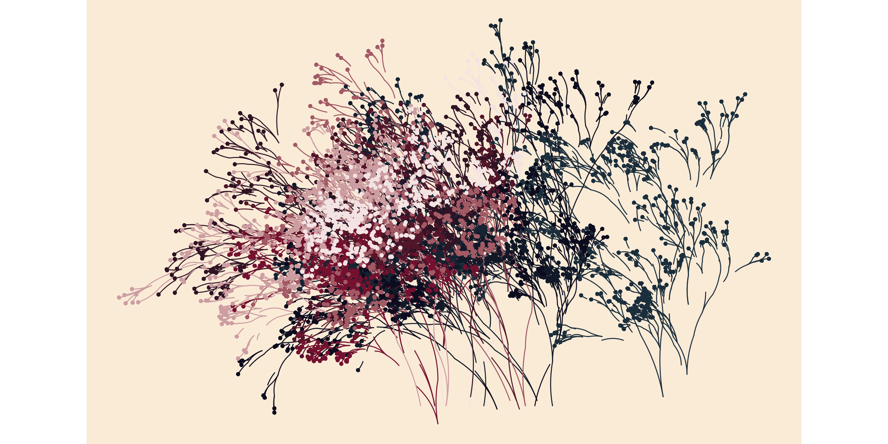

# Flametree

Flametree provides a system for making generative art in R, written with
two goals in mind. First, and perhaps foremost, art is inherently
enjoyable and generative artists working in R need packages no less than
any other R users. Second, the system is designed to be useful in the
classroom: getting students to make artwork in class is an enjoyable
exercise and flametree can be used as a method to introduce some key R
concepts in a fun way. You can install the current version of flametree
with:

``` r

install.packages("flametree")
```

Alternatively you can install the development version of flametree with:

``` r

# install.packages("devtools")
devtools::install_github("djnavarro/flametree")
```

Flametree is fairly flexible and produces art in several different
styles. One example is shown here, other possibilities are described
throughout the documentation.

``` r

library(flametree)

# pick some colours
shades <- c("#1b2e3c", "#0c0c1e", "#74112f", "#f3e3e2")

# data structure defining the trees
dat <- flametree_grow(time = 10, trees = 10)

# draw the plot
dat %>% 
  flametree_plot(
    background = "antiquewhite",
    palette = shades, 
    style = "nativeflora"
  )
```


